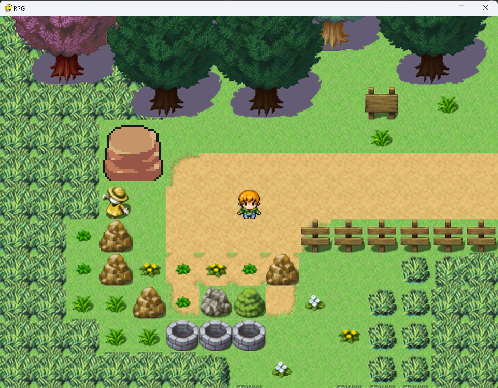
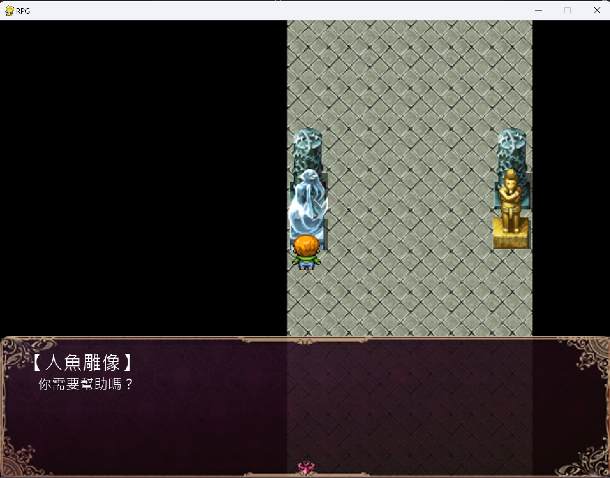
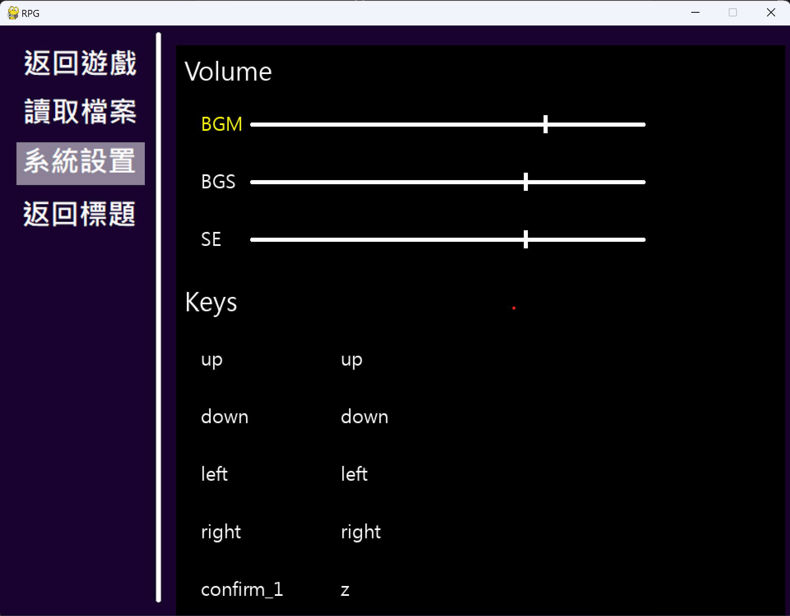

# The Pygame RPG Maker

A mini-RPG maker built with Python and Pygame.

Requirements: Python 3.11, Pygame 2.5.2




▲ Sample images of the running game. 

## Tutorial

### How to build the game?

To build a RPG game by this maker, objects below are required.

1. **Json Files for Every Maps** 

    These are the basic components for the maps, events, bgm, etc for the whole game, which are located at `./Dev/data/map/Map*.json`. 

    As for how to built them, view \
    [tutorial](./Tutorial/map-data.md).

2. **Map Tile Files** 

    Map csv files are located at `./Dev/Map/map*/map_*.csv`. These files are aiming to let system know how to draw the map, including visible objects, invisible events, etc.

    Every map has its own folder, in which there will be 8 csv files. 

    1. map_AnimationBlockDetails.csv
    2. map_AnimationBlockObjects.csv
    3. map_Details.csv
    4. map_Entities.csv
    5. map_Events.csv
    6. map_FloorBlocks.csv
    7. map_Groundtype.csv
    8. map_Objects.csv
    
    Each file has rows * columns = height * width numbers, which denote the graphics/events id in each map. (-1 for null)

    To build the tile files more easily, you can try to use [Tiled](https://www.mapeditor.org/).

3. **Graphic Files** 

    Graphics are located at `./Dev/Graphics`, in which there are neccessary folders named 
    
    1. animations
    2. bgtile
    3. details
    4. items
    5. layer
    6. objects
    7. player
        - player/down
        - player/down_idle
        - player/left
        - player/left_idle
        - player/right
        - player/right_idle
        - player/up
        - player/up_idle
    8. tilemap

    For details for these graphics, view \
    [tutorial](./Tutorial/graphics.md).

4. **Audio Files** 

    Audio files are located at `./Dev/Audio`, in which folders below are neccessary.
    
    1. BGS
    2. SE

    It is better to use `.ogg` or `.mp3` files as audio files.

5. **Dialog Script Files** 

    Dialog texts in the games must be collected to `./Dev/Script`.
    
    For details about how to build a script file, view \
    [tutorial](./Tutorial/script.md).

6. **Settings File** 

    Settings file for the game is located at `./Dev/data/settings/settings.json`.

    For detials about the components of settings file, view \
    [tutorial](./Tutorial/settings.md).

7. **Saving folder**

    There must be a folder to save all of the game savings, which is located at `./Dev/data/save`.

Other adjustable objects are showing below.

1. **Font**

    Font path: `./Dev/Font/font.ttf`

2. **Python Settings File**

    This is the system settings. If not neccessary, do not edit it.

    Settings path: `./Dev/System/settings.py`

3. **Customized Events**

    If you are familiar with Python, you can make your own events by adding classes and functions in `./Dev/System/event`.

    The game construction are demonstrated [here](./Tutorial/construction.md).

### How to run the game?

Change the work folder to `./Dev/System`, and run `python3 main.py` in your terminal.
```shell
cd ./Dev/System
python3 main.py
```
Make sure you have installed required environments.

### How to setup the environments?
1. **Install Python** 

    For Windows/Mac users, go to [https://www.python.org](https://www.python.org) to get the official installer, and install it into your computer. Make sure you have install the python3 command into your environment variables. 

    For Linux users (taking Ubuntu for example), run
    ```shell
    sudo apt install python3
    ```

2. **Install Pygame Package** 

    For Windows/Mac users, run command below in your terminal.
    ```shell
    pip install pygame
    ```

    For Linux users (taking Ubuntu for example), run command below in your terminal.
    ```shell
    sudo apt install python3-pygame
    ```